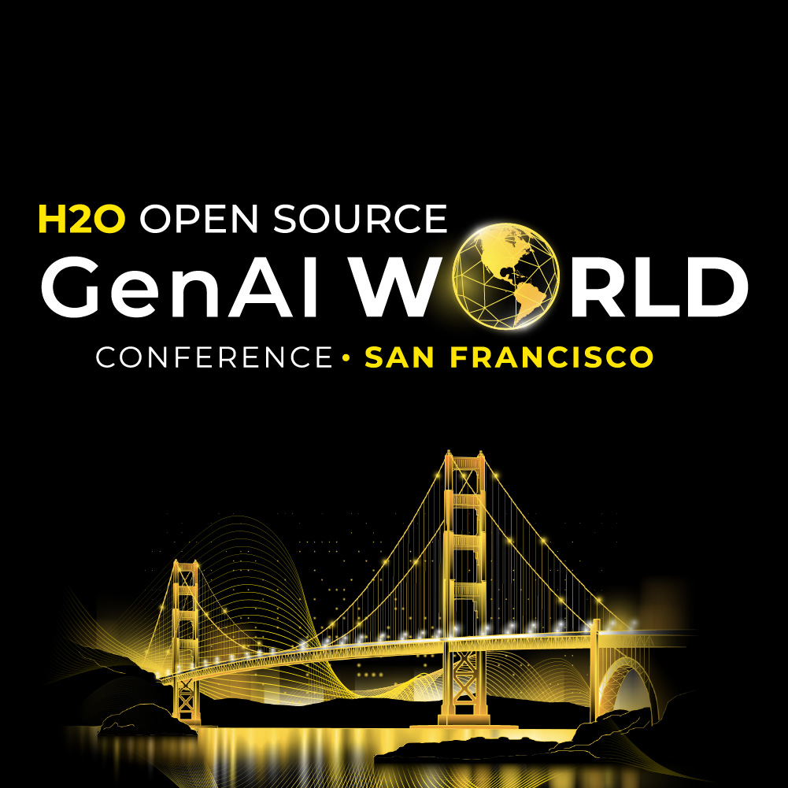

Welcome to the repository for the H2O World Generative AI conference taking place
on November 7th, 2023 in San Francisco.

In this repository, you will find a series of Jupyter Notebooks that walk through
the end to end process of building GPT applications for yourself or your organization.

Most of these notebooks are standalone and focus on education through open source
software from 🤗 Hugging Face, NVIDIA, and of course H2O.ai. 

However, Labs 4, 5 and 6 leverage commercial tools such as Enterprise h2oGPT, 
the H2O AI Cloud platform, H2O MLOps, and the H2O AI AppStore. In the case of Lab 4 (RAG),
one can optionally replace the vector database and document processing techniques 
with open source alternatives such as Chroma or FAISS. In the case of Lab 6 (AI Application),
the AI Appstore is not required for deploying open source Wave apps (but it is highly
recommended to have in production settings).
